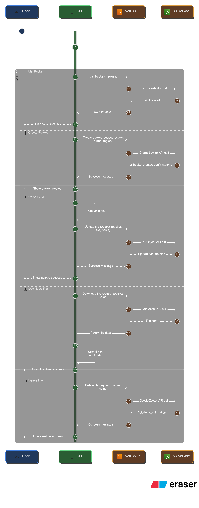

📦 AWS S3 File Manager CLI
AWS S3 File Manager CLI is a lightweight and powerful command-line tool designed to simplify interaction with Amazon S3 buckets. It provides developers and system administrators with an easy way to manage files and buckets directly from the terminal.

✨ Features
Bucket Management

Create new S3 buckets with ease

List existing buckets in your AWS account

File Operations

Upload files to S3 buckets

Download files from S3 buckets

Delete files from S3 buckets

Efficiency

Fast and reliable operations using AWS SDK (Boto3)

Clear error handling and informative output

🚀 Why Use This?
Managing S3 resources often requires switching between the AWS Console and scripts. This CLI tool streamlines the process, allowing you to perform essential operations quickly without leaving your terminal. Perfect for DevOps workflows, automation scripts, and everyday file management tasks.

🛠️ Tech Stack
Language: Python

Library: Boto3 (AWS SDK for Python)

Interface: Command-Line


📖 Getting Started
Configure your AWS credentials (aws configure)

Clone this repository

Run commands like:

```
py code.py list
py code.py create_bucket --bucket s3-from-boto3 --region ap-south-1
py code.py upload --bucket demo-bucket-from-boto3 --file <local file path here> --name testname.png            
y code.py download --bucket jigar-bucket-from-boto3 --file <local file path here>  --name testname.png
py code.py delete  --bucket jigar-bucket-from-boto3  --name testname.png

```
## Diagram --> [Diagram link](https://app.eraser.io/workspace/DHhnAWqGpzVd91CmG3qB?origin=share)


